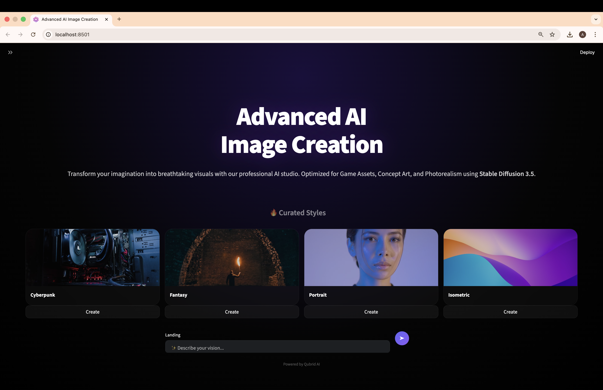
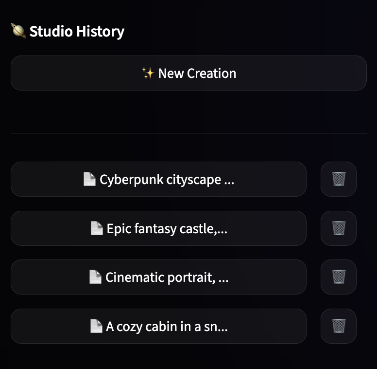
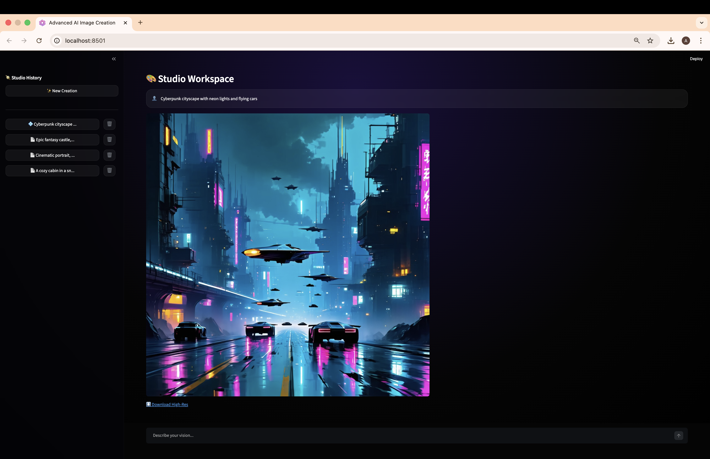

<div align="center">


# Advanced AI Image Creation Studio 🌌

A professional-grade, high-fidelity AI image generation platform. Transform complex text prompts into breathtaking visual art, game assets, and photorealistic portraits in seconds.

[](https://www.python.org/downloads/)
[](https://streamlit.io/)
[](https://stability.ai/)
[](LICENSE)

</div>

---
## ✨ Features

- **💎 Glassmorphism UI** - A premium, modern interface with frosted glass components and deep purple Qubrid-inspired accents.
- **⚡ Instant Quantum Rendering** - Rapid image generation powered by Stable Diffusion 3.5 via the Qubrid AI infrastructure.
- **🎨 Curated Style Templates** - One-click access to professionally engineered prompts for Cyberpunk, Fantasy, Portraiture, and Isometric 3D styles.
- **🔍 Intelligent Prompting** - Centered, search-engine style input for a clean, focused "Landing Page" experience.
- **📂 Studio Workspace** - A dedicated creative environment with persistent history, image previews, and high-res downloads.
- **📥 High-Res Exports** - Integrated base64-encoded download system for instant PNG asset acquisition.

---

## 📸 Studio Gallery

### 🚀 Professional Landing Page


*A distraction-free entry point featuring a sleek, ChatGPT-style centered search bar and curated style templates. The interface is optimized for high-performance creative workflows.*

---

### 🎨 Creative Workspace & Progress Tracking


*Monitor your creation in real-time with our transparent "Quantum Rendering" status. This view keeps the glass UI vibrant without dimming the background lights during processing.*

---

### 👾 High-Fidelity Asset Generation


*Experience superior model adherence with Stable Diffusion 3.5. Instantly download your high-resolution masterpieces directly from the studio workspace using the integrated asset manager.*

---

## 📁 Project Structure

```

advanced-ai-image-creation/
├── .streamlit/              # Streamlit config (Dark Mode enforcement)
├── .env                      # API keys (not in Git)
├── .gitignore                # Git exclusions (data, db, env)
├── pyproject.toml            # Unified dependency management
├── assets.db                 # SQLite database for prompt/image history
│
├── backend/
│   ├── graph.py              # LangGraph workflow orchestration
│   ├── nodes.py              # AI generation & model logic
│   ├── state.py              # Workflow data structures
│
├── database/
│   └── db.py                 # SQLite operations for session persistence
│
└── frontend/
    ├── assets/               # Branding banner and UI screenshots
    ├── app.py                # Main UI & View Controller
    ├── sidebar.py            # History & Studio navigation
    └── styles.py             # Premium Glassmorphism CSS

```

---

## 🎯 How It Works

1. **Dream** → Describe your vision in the centered "Landing" search bar.
2. **Style** → Select a curated template or write a custom professional prompt.
3. **Render** → Our LangGraph-powered backend orchestrates the SD 3.5 pipeline.
4. **Manage** → Access your entire creation history via the persistent sidebar.
5. **Download** → Click "Download High-Res" to save your masterpiece.

---

## 🛠️ Tech Stack

- **Inference**: Stable Diffusion 3.5 via [Qubrid AI API](https://qubrid.com)
- **Orchestration**: LangGraph for stateful AI workflow management
- **Interface**: Streamlit with custom CSS (Glassmorphism)
- **Persistence**: SQLite for local project and message history
- **Package Management**: Managed by `uv`

---

## 🚀 Quick Start

### Installation
```bash
# 1. Clone the repository
git clone https://github.com/aryadoshii-qubrid/advanced-ai-image-creation.git
cd advanced-ai-image-creation

# 2. Install UV package manager
curl -LsSf https://astral.sh/uv/install.sh | sh

# 3. Install dependencies
uv pip install -e .

# 4. Set up API key
cp .env.example .env
nano .env  # Add your QUBRID_API_KEY

# 5. Run the Studio App
uv run streamlit run frontend/app.py

```

---

<div align="center">

  **Made with ❤️ by Qubrid AI**

</div>
