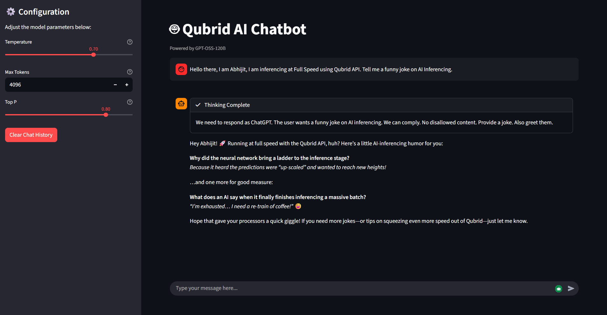

# Qubrid AI Chatbot with Reasoning 🤖💭

This recipe demonstrates how to build a conversational chatbot using the Qubrid API and LangChain. It features a custom LangChain model integration that supports streaming responses and reasoning capabilities (thinking process) from the `openai/gpt-oss-120b` model.

## Features

- **Custom LangChain Integration**: A robust `ChatQubrid` class that handles streaming and reasoning tokens.
- **Reasoning Display**: Shows the model's "thinking" process before the final response.
- **Three Interfaces**:
  1.  **Basic Chat**: Simple text-based chat.
  2.  **chatbot**: Beautiful terminal UI with markdown support.
  3.  **Chatbot App**: Interactive web interface with parameter controls.

## Prerequisites

You need a Qubrid API Key to run this project.

1.  Go to [platform.qubrid.com/api-keys](https://platform.qubrid.com/api-keys).
2.  Create a new API Key.
3.  **Bonus**: Get started with free 4M tokens (worth $1) upon sign-up!

## Setup

1.  **Clone the repository**:

    ```bash
    git clone https://github.com/QubridAI-Inc/qubrid-cookbook.git
    cd qubrid-cookbook/LLMs/reasoning_chatbot
    ```

2.  **Install Dependencies**:

    ```bash
    pip install uv
    uv pip install -r requirements.txt
    ```

3.  **Configure API Key**:  
    Open the python files (`basic_chat.py`, `gpt_oss_chatbot.py`) and replace the placeholder `API key` with your actual key:
    ```python
    qubrid_api_key = "YOUR_QUBRID_API_KEY"
    ```
    _(Note: `chatbot_app.py` imports the key and model from `chatbot.py`, so you only need to update it there for the App and Rich CLI)_

## Usage

### 1. Basic Chat

The simplest implementation using standard Python input/output. Good for understanding the core logic.

```bash
python basic_chat.py
```

### 2. Rich Chatbot

A polished terminal experience using the `rich` library. It features colored output, markdown rendering, and a live "Thinking" status panel.

```bash
python chatbot.py
```

### 3. Streamlit Web App

A full-featured web interface.

- **Interactive UI**: Chat bubble interface.
- **Configuration**: Adjust Temperature, Max Tokens, and Top P via the sidebar.
- **Reasoning**: Expandable "Thinking..." section to see the model's logic.

```bash
streamlit run chatbot_app.py
```

## Project Structure

- `basic_chat.py`: Basic implementation of the chatbot loop.
- `chatbot.py`: Contains the `ChatQubrid` class definition and the Rich CLI implementation. This is the core module.
- `chatbot_app.py`: The Streamlit user interface code.

## UI Screenshots



_Powered by Qubrid AI_
