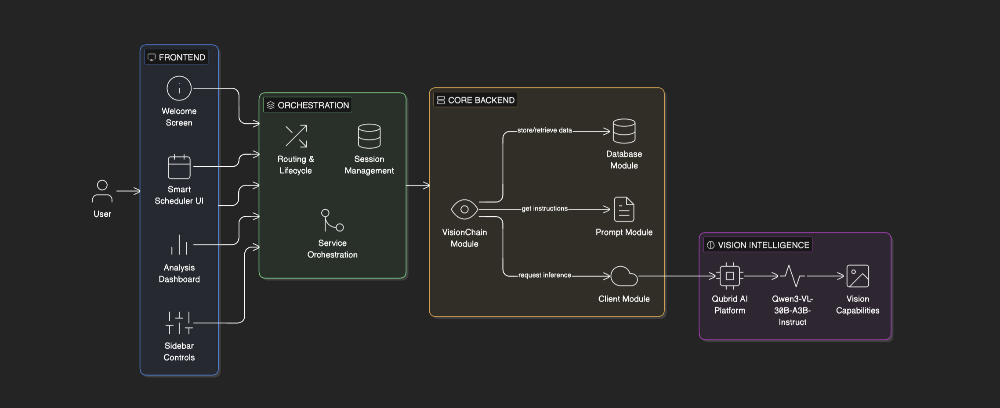
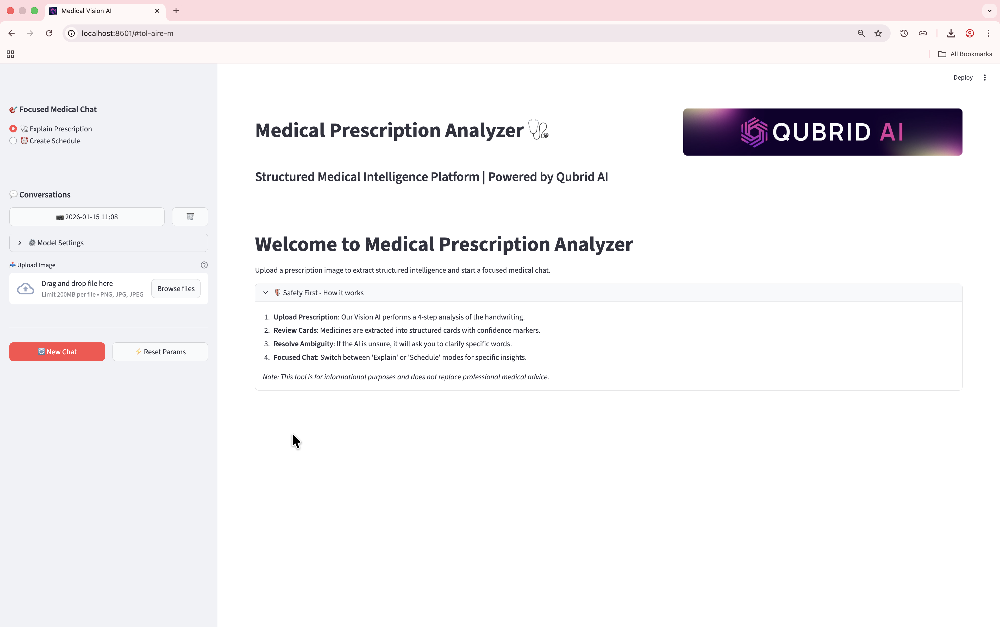
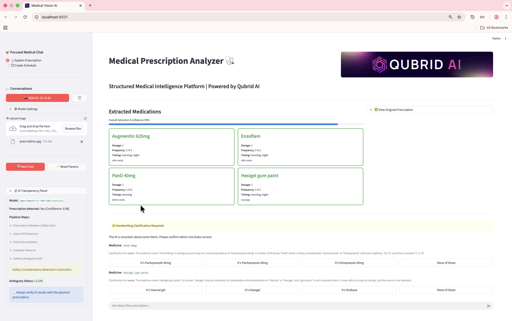
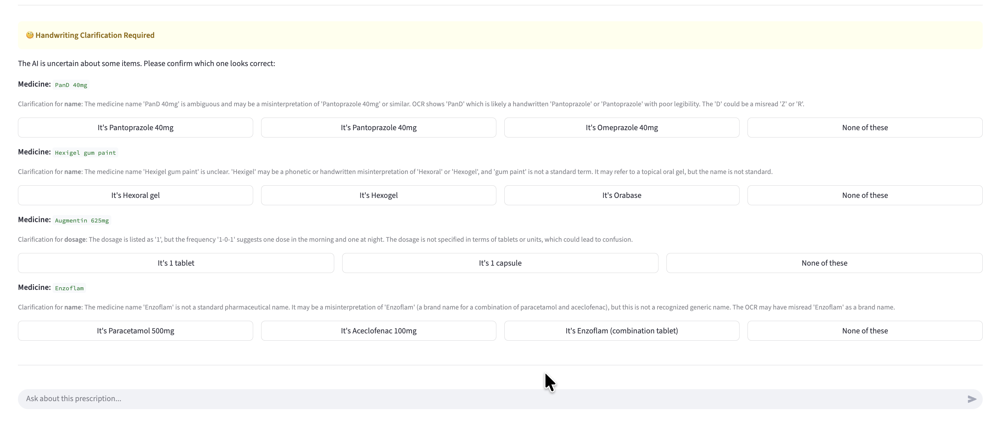
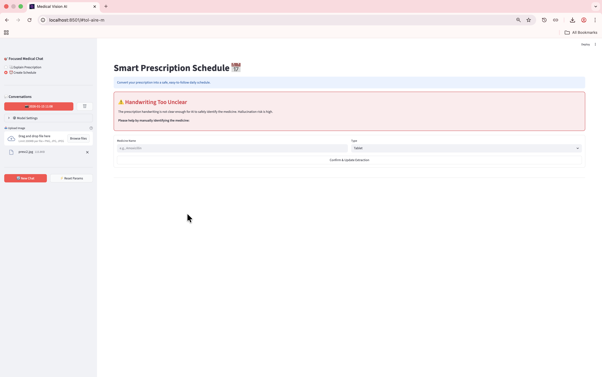
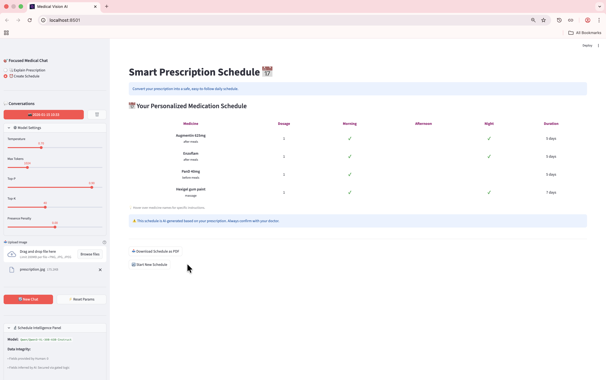
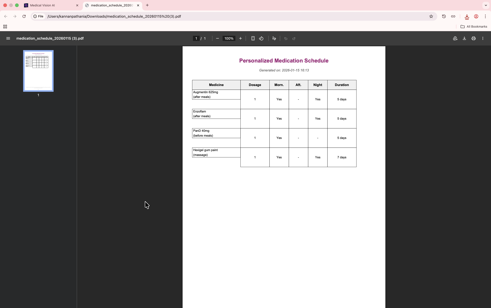

<div align="center">
  
</div>

> A production-ready Medical Prescription Analyzer Chatbot powered by Qubrid AI's advanced vision model Qwen3-VL-30B-A3B-Instruct

[](https://www.python.org/downloads/)
[](https://streamlit.io)
[](https://langchain.com)

# Medical Prescription Analyzer Chatbot

A production-grade, structured medical intelligence platform powered by **Qubrid AI**, **LangChain**, and **Streamlit**. This assistant specializes in analyzing medical prescriptions (handwritten or digital) through a multi-step vision reasoning pipeline, extracting structured data, and providing focused medical insights.

---
## Problem Statement

Understanding handwritten medical prescriptions is a long-standing and critical challenge in healthcare systems. Doctors often write prescriptions in highly inconsistent and cursive handwriting, making them difficult to interpret even for trained pharmacists and patients. This leads to several issues:
- Unreadable or ambiguous medicine names
- Incorrect dosage interpretation
- Unclear timing instructions (morning / afternoon / night)
- High risk of medication errors
- Lack of structured, machine-readable prescription data

Traditional OCR systems fail in this domain because medical prescriptions contain:
- Irregular handwriting styles
- Abbreviations and shorthand medical terms
- Overlapping text and poor image quality
- Context-dependent interpretation (dosage, frequency, timing)

A key challenge is that not all prescriptions are resolvable, and blindly generating structured output from low-quality or ambiguous inputs can produce dangerous and misleading results.

## Solution Overview

To solve this problem, I built a Vision-AI–powered Medical Prescription Analyzer that intelligently understands handwritten prescriptions and converts them into structured, reliable medical data.

### 1. Vision-Based Prescription Understanding
Instead of using traditional OCR pipelines, the system leverages the Qwen3-VL-30B-A3B-Instruct multimodal vision model, which is capable of:
- Understanding handwritten text directly from prescription images
- Interpreting medical context (medicine name, dosage, frequency, timing)
- Reasoning across multiple lines and symbols instead of simple text extraction

The model processes prescription images and extracts:
- Medicine names
- Dosage information
- Intake frequency
- Time of consumption (morning / afternoon / night)

The extracted information is then converted into a structured prescription format, enabling further analysis and visualization.

### 2. Confidence-Aware Intelligence (Critical Safety Layer)
One of the core problems with handwritten prescriptions is that some inputs are inherently unreadable, even for advanced vision models. To prevent incorrect or hallucinated outputs, I implemented a confidence-aware validation layer:
- Each extracted entity (medicine name, dosage, timing) is evaluated with a confidence score.
- If the confidence score falls below 0.7, the system:
    - Does not generate structured output.
    - Displays a clear warning to the user.
    - Explicitly asks the user for manual confirmation or correction.

This ensures no garbage or misleading medical data is generated, the system fails safely instead of guessing, and users are informed when AI understanding is uncertain.

### 3. User-Centric Error Handling
When a prescription cannot be confidently understood:
- The UI shows a warning state instead of ambiguous results.
- The user is prompted to manually input or verify unclear details.
- The system maintains transparency about AI limitations.

This design prevents over-trust in AI outputs and improves real-world usability.

## Key Outcomes
- Successfully converts handwritten prescriptions into structured medical intelligence.
- Handles extremely unreadable prescriptions with safe fallback mechanisms.
- Reduces risk of medication errors caused by AI hallucinations.
- Combines vision intelligence with confidence-based decision making.

---

## ⚙️ Installation & Setup

1.  **Clone the repository**:
    ```bash
    git clone <repository-url>
    cd medical-prescription-analyzer-chatbot
    ```

2.  **Install dependencies**:
    ```bash
    uv sync
    ```

3.  **Configure Environment**:
    Create a `.env` file with your `QUBRID_API_KEY`

    You can create your Qubrid API Key from this link: [https://www.qubrid.com/models/Qwen3-VL-30B-A3B-Instruct](https://www.qubrid.com/models/Qwen3-VL-30B-A3B-Instruct)

    ```bash
    QUBRID_API_KEY= <YOUR_QUBRID_API_KEY>
    QUBRID_API_BASE=https://platform.qubrid.com/api/v1/qubridai/multimodal/chat
    ```

4.  **Run the application**:
    ```bash
    uv run streamlit run app.py
    ```

---


## 📂 Project Structure

```bash
.
├── app.py                # Main Streamlit application & router
├── backend/
│   ├── chain.py          # VisionChain logic (OCR -> Audit -> Schedule)
│   ├── prompt.py         # Multi-step medical prompts
├── db/                   # SQLite database & access logic
├── services/             # Core business logic (Extraction, Restoration)
├── scheduler/            # Schedule-specific logic and PDF export
├── frontend/
│   ├── pages/            # Page-specific orchestrators
│   ├── ui_components.py  # Shared UI elements
│   └── session_utils.py  # Shared session state management
└── README.md             # Project documentation
```

---

## 🏗️ System Architecture

The following diagram and breakdown illustrate the project's 4-layer modular architecture, ensuring safety, scalability, and clear separation of concerns.



### 🧩 Architectural Layers

#### **Layer 1: User Interface (Frontend)**
*Built with Streamlit, providing a high-fidelity, interactive experience.*
*   **Welcome Screen**: Features an automated onboarding guide and safety instructions.
*   **Sidebar Controls**: Manages conversation history, model parameters, and global image uploads.
*   **Analysis Dashboard**: Renders color-coded medicine cards with confidence markers and an AI transparency panel.
*   **Smart Scheduler UI**: Dedicated interface for converting extractions into visual daily timelines.

#### **Layer 2: Application Logic (Orchestration)**
*The glue layer that manages state and coordinates between the UI and Backend.*
*   **Routing & Lifecycle (`app.py`)**: Handles multi-page navigation between the Analyzer and Smart Scheduler.
*   **Session Management**: Maintains persistent state across workflows, ensuring data consistency.
*   **Service Orchestration**: Coordinates high-level services like Extraction and Image Validation.

#### **Layer 3: Modules (Core Backend)**
*The engine of the application, responsible for processing data and persistence.*
*   **VisionChain Module (`chain.py`)**: Orchestrates the **4-step Reasoning Pipeline** (Validation → OCR → Normalization → Audit).
*   **Database Module (`db/`)**: SQLite persistence for image hashes, structured extractions, and chat history.
*   **Prompt Module (`prompt.py`)**: Optimized medical instructions and safety guidelines for the Vision AI.
*   **Client Module (`qubrid_client.py`)**: Robust wrapper for the Qubrid API with SSE streaming support.

#### **Layer 4: External API (Vision Intelligence)**
*The foundational intelligence layer powered by Qubrid AI.*
*   **Qubrid AI Platform**: Hosts the industrial-grade vision infrastructure.
*   **Model**: `Qwen3-VL-30B-A3B-Instruct` — capable of complex handwriting recognition and medical reasoning.

---

## 📸 UI Screenshots

### Home Page & Upload

*Professional landing page with Qubrid AI branding and safety documentation.*

### Prescription Analysis View

*Detailed 4-step analysis results with confidence-coded medicine cards and AI transparency panel.*

### Handwriting & Ambiguity Clarification

*Interactive UI for resolving handwriting ambiguities when the Vision AI detects multiple potential candidates.*

### Smart Schedule Generation (Blocking State)

*The system prevents schedule generation when handwriting is unresolvable, prompting manual user input for safety.*

### Prescription Timeline & Daily Schedule

*Final daily medication schedule with Morning, Afternoon, and Night slots.*

### PDF Export

*Downloadable medication schedules for offline use, including mandatory health disclaimers.*

---

## 🚀 Key Features

### 🔍 4-Step Medical Reasoning Pipeline
The core of the application is a robust backend pipeline that processes prescription images:
1.  **Vision OCR Extraction**: Transcribes text from the image, focusing on medicine names and dosages.
2.  **Entity Normalization**: Converts raw text into a structured JSON schema.
3.  **Ambiguity Audit**: Identifies low-confidence extractions or missing information.
4.  **Final Audit**: Performs a safety check on extracted instructions and conflicting timings.

### 📅 Smart Prescription Schedule 
A specialized, safety-first workflow to convert prescriptions into daily timelines:
-   **Readiness Gate**: Automatically flags missing critical info (Dosage, Frequency, Duration).
-   **Guided Clarification**: Interactive form-based UI to fill data gaps before generation.
-   **Visual Timeline**: Tabular daily schedule with Morning/Afternoon/Night slots.
-   **PDF Export**: Downloadable medication schedule with mandatory patient disclaimers.

### 💾 Persistent Intelligence (SQLite)
-   **Conversation Restore**: Automatic storage of prescriptions and chat history.
-   **Duplicate Detection**: Calculate SHA-256 hashes to instantly restore previously analyzed images.
-   **Multi-Page State**: Consistent data across "Analyzer" and "Smart Scheduler" workflows.

## 🔗 Official Resources

-   **Qubrid Official Cookbooks**: [Explore on GitHub](https://github.com/QubridAI-Inc/qubrid-cookbook)
-   **Qubrid YouTube Channel**: [Watch Tutorials](https://www.youtube.com/watch?v=1LX-w2Sgvts&list=PLoaE-lmLecgPoYuSa2BsmlJ8isKB5KFtq)

---

## ⚠️ Disclaimer

**This tool is for informational and educational purposes only.** The analysis provided is AI-generated and should **not** be used for self-diagnosis or treatment. **Always verify any AI analysis with a qualified healthcare professional or pharmacist before taking any medication.**

---
<div align="center">

Made with ❤️ by Qubrid AI

⭐ Star this repository if you find it helpful!

</div>

